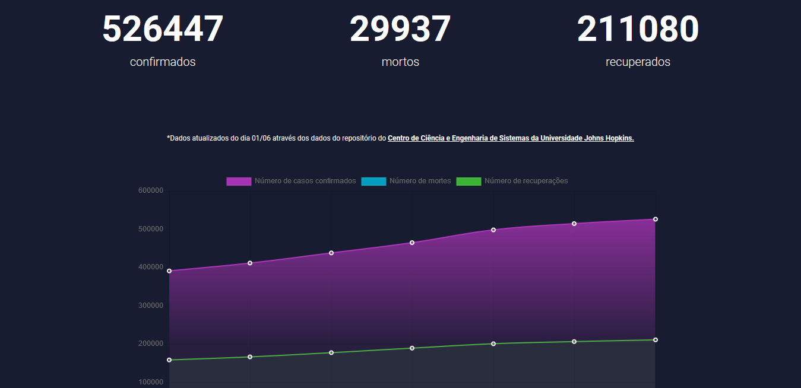

# COVID-19 no Brasil

Um Website com o objetivo de informar sobre o surto do COVID-19 no Brasil, feito em PHP e JQuery, utilizando cURL para acesso de API REST.

 para acessar.

Projeto criado utilizando os dados da .
